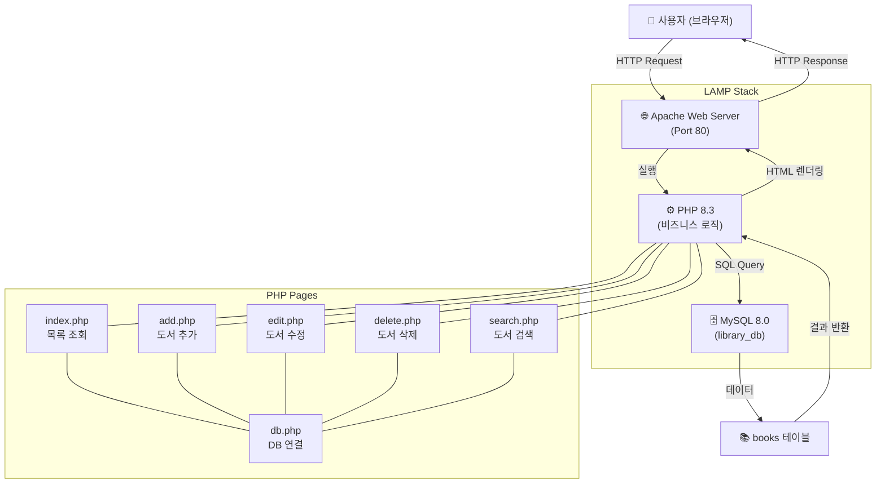
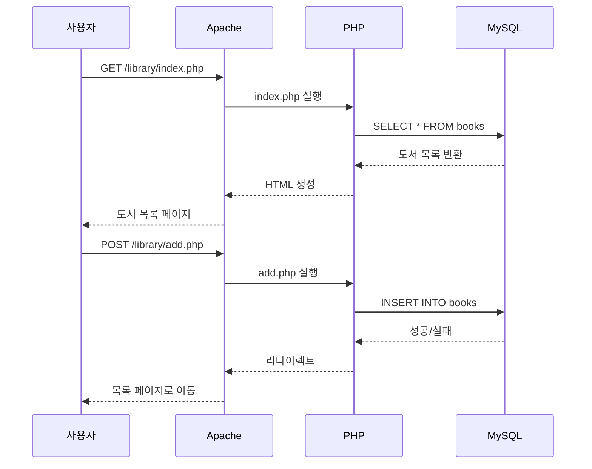

# 도서 관리 시스템 (Library Management System)

## 프로젝트 개요
LAMP Stack(Linux + Apache + MySQL + PHP)을 활용한 도서관 도서 관리 웹 애플리케이션입니다.

## 개발 환경
- OS: Zorin OS (Ubuntu 기반)
- Web Server: Apache 2.4
- Database: MySQL 8.0
- Language: PHP 8.3
- Frontend: HTML5, CSS3 (Bootstrap 5)

## 주요 기능
1. **도서 목록 조회** - 전체 도서 리스트 출력
2. **도서 추가** - 제목, 저자, 출판사, 출판연도, 수량 입력
3. **도서 수정** - 기존 도서 정보 편집
4. **도서 삭제** - 도서 삭제 (확인 후 삭제)
5. **도서 검색** - 제목 또는 저자명으로 검색

## 데이터베이스 설계
- **DB명**: library_db
- **테이블**: books

| 컬럼명      | 타입         | 설명         |
|-------------|--------------|--------------|
| id          | INT (PK, AI) | 도서 고유 ID |
| title       | VARCHAR(255) | 도서 제목    |
| author      | VARCHAR(100) | 저자명       |
| publisher   | VARCHAR(100) | 출판사       |
| pub_year    | YEAR         | 출판연도     |
| quantity    | INT          | 보유 수량    |
| created_at  | TIMESTAMP    | 등록일시     |

## 파일 구조
```
/var/www/html/library/
├── index.php        # 도서 목록 (메인)
├── add.php          # 도서 추가 폼
├── edit.php         # 도서 수정 폼
├── delete.php       # 도서 삭제 처리
├── search.php       # 도서 검색
├── db.php           # DB 연결 설정
└── style.css        # 공통 스타일
```

## 시스템 아키텍처 (Mermaid 블록도)



## CRUD 흐름도


